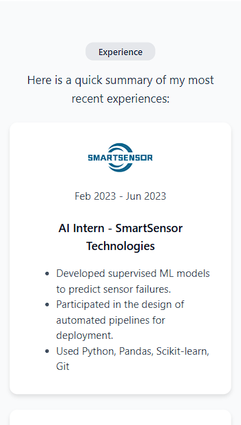

This project consists of the development of a static personal portfolio, implemented entirely with HTML and CSS, based on a Figma design template.
The main goal is to faithfully reproduce the original design across both desktop and mobile devices, applying responsive design principles using Flexbox, CSS Grid, and media queries.

The website includes well-structured sections such as introduction, projects, and about, presenting the content with clean visual hierarchy, consistent spacing, and balanced typography to ensure a professional and coherent layout.

Project Preview:
- **Desktop View**

- **Mobile View**

Deployment Notes:
The project was deployed using Firebase Hosting, following the official configuration steps. 
Besides, the Firebase project is linked to the GitHub repository, so every time a new commit and push is made, the live website automatically updates with the latest version of the code.

LINKS:
URL Web Page --> https://portfolio-javier-revuelta.web.app/
Github Repository Link  --> https://github.com/JavierRevueltaFernandez/Servicios-Web
Figma Template Link --> https://www.figma.com/community/file/1262992249991763120
